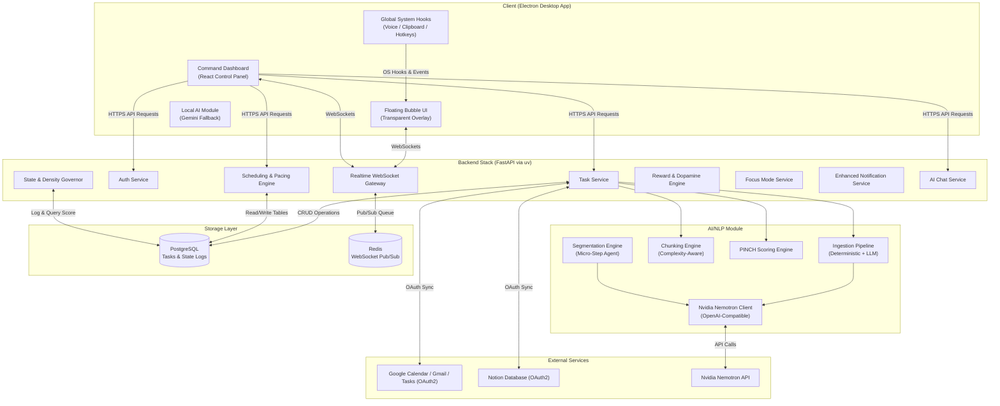
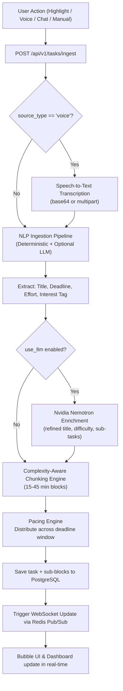
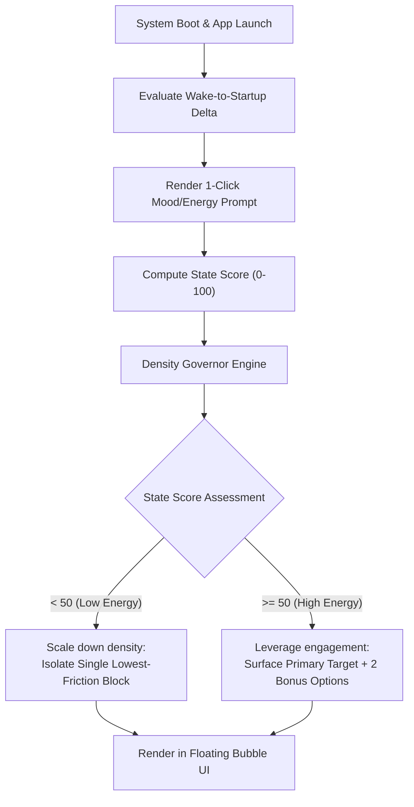
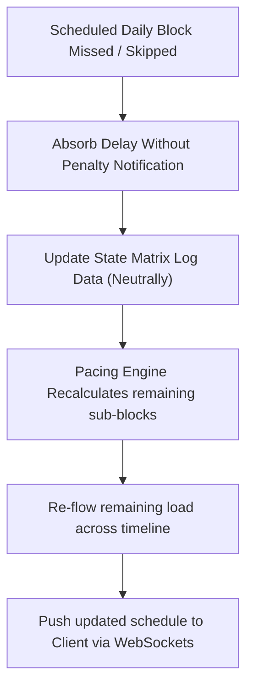
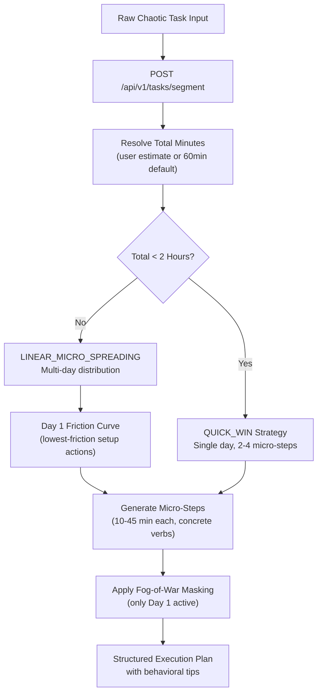
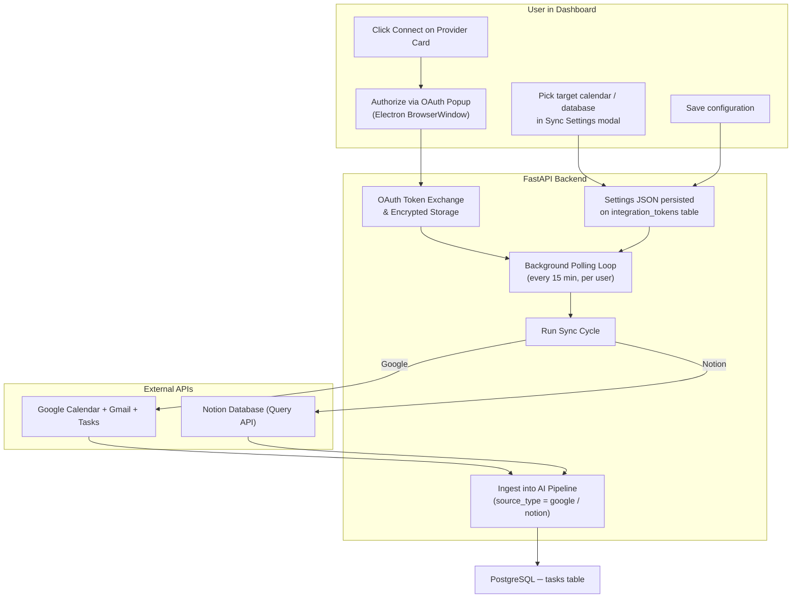
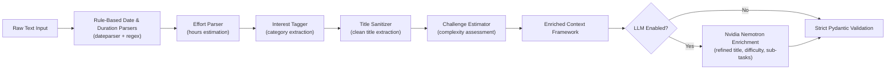

# dopaPal 🧠✨

### The Ambient Cognitive Translation Layer for the ADHD Brain

dopaPal is an omnipresent, non-intrusive cognitive companion designed to align rigid work and study environments with the Interest-Based Nervous System. Instead of forcing neurodivergent users into linear, high-friction productivity workflows that fuel task paralysis and decision fatigue, dopaPal functions as an invisible, supportive secretary. It silently captures chaos via low-friction input vectors, algorithmically slices overwhelming projects into daily blocks, and paces execution based on real-time cognitive energy.

---

## 🧭 Product Identity: The Ambient Cognitive Sidekick

dopaPal is **not** a "productivity app," a "to-do list," or a "task manager." Those traditional tools are built for linear, neurotypical brains and inherently rely on shame, pressure, and overwhelming walls of text — the exact triggers that cause task paralysis and executive dysfunction.

dopaPal is an **Ambient Cognitive Sidekick**. Its fundamental identity is failure-neutral, highly adaptive, creative, and companion-led. Every feature, button, visual, and sound in the system filters through this core identity.

### 1. The Three Core Design Pillars

Every feature and layout decision must pass these three strict tests:

#### Pillar A: Anti-Friction Ingestion — Zero "Blank Canvas" Panic

**The Rule:** The user should never be forced to stare at an empty, clinical text form with 10 fields just to add something to their plate.

**How it looks in design:** Ingestion is always conversational, ambient, or interactive. Dragging an item onto the bubble's face, speaking to the Audio Lab, or letting the agent parse a chaotic Jira dump behind the scenes are the default entry points. The system takes on the administrative burden of organization so the user doesn't have to.

#### Pillar B: Failure-Neutral Framing — Zero Shame, Zero Red Badges

**The Rule:** Traditional apps use bright red alerts, exclamation marks, and loud "OVERDUE" text to create artificial urgency. For an ADHD brain, this causes immediate avoidance, guilt, and burnout.

**How it looks in design:** Time is fluid in dopaPal. If a task isn't finished during a sprint, the system never punishes the user. The bubble simply yawns or takes a breath, and the agent recalculates the plan: *"Looks like our calibration was a bit off for today. No big deal, I've re-spaced the steps so we can tackle them comfortably tomorrow."*

#### Pillar C: Radical Visual & Auditory Simplification — The "Fog-of-War"

**The Rule:** Seeing 50 tasks at once triggers a massive cognitive freeze. The system must always have the ability to mask out the noise.

**How it looks in design:** The interface supports extreme density reduction. When a user is in a low energy state, the dashboard drops away entirely. The screen belongs to the animated bubble, displaying only one single, achievable micro-step (e.g., *"Just open the document"*), masking the rest of the mountain until they are ready.

### 2. Cohesive Feature Synergy — How It All Plugs Together

Because the system is an ecosystem companion, features shouldn't feel like separate, disjointed tabs. They flow into one another naturally through the bubble's presence:

```
                  ┌──────────────────────────────┐
                  │  "Get to Know You" Onboarding │ (Static Context)
                  └──────────────┬───────────────┘
                                 │
                                 ▼
                  ┌──────────────────────────────┐
                  │    Daily State Pulse Check   │ (Dynamic Capacity Score)
                  └──────────────┬───────────────┘
                                 │
                                 ▼
                  ┌──────────────────────────────┐
                  │    The Aware Bubble UI       │◄───┐ Updates expression
                  │ (Main Presence & Interaction)│    │ & limits visibility
                  └──────┬────────────────┬──────┘    │
                         │                │           │
          ┌──────────────┴──────┐  ┌──────┴───────────┴──┐
          │     Agent Mode      │  │      Ask Mode       │
          │ (System Execution / │  │ (Support Sanctuary /│
          │  Jira & Cal Sync)   │  │  ADHD Research Hub) │
          └──────────────┬──────┘  └─────────────────────┘
                         │
                         ▼
                  ┌──────────────────────────────┐
                  │      Focus Progression       │
                  └──────────────┬───────────────┘
                         │ (Earns Tokens)
                         ▼
                  ┌──────────────────────────────┐
                  │         The Shop             │
                  │ (Buy Visuals, Themes, Sounds)│
                  └──────────────┬───────────────┘
                                 │
                                 ▼
                  ┌──────────────────────────────┐
                  │       The Audio Lab          │
                  │ (Mix Custom Focus Ambience)  │
                  └──────────────────────────────┘
```

### 3. The Identity Checklist for the Engineering & Design Team

As the team builds out features, these explicit guidelines govern how things should look, feel, and sound:

- **Visual Motion:** The bubble shouldn't sit rigidly on top of windows. It should feel smooth, bouncy, and fluid. When the user hovers over it, it should look up curiously. When music plays in the Audio Lab, it should groove.
- **Sound Design:** Interface sounds should be soft, round, and highly satisfying — like mechanical keyboard thocs, soft wooden clicks, or gentle ambient chimes. Avoid high-pitched digital beeps or harsh alarms for timers.
- **The Shop Aesthetics:** Purchasing themes or sound layers from the shop should feel like unlocking a reward in a cozy sandbox game. The interface should celebrate the user's progress with playful animations.
- **The Assistant's Tone:** The conscious AI agent is an ally, a co-pilot, and a friend. It uses encouraging, warm, and structured language. It never talks down to the user or acts like an unyielding corporate manager.

---

## 🎨 Visual & Tone Identity: Cozy, Organic, and Playful

If the app feels like an enterprise tool, the brain treats it like an enterprise obligation. By making it intentionally **fun, creative, and friendly**, it feels like a video game or a cozy sandbox environment.

### 1. The Visual DNA

- **Chubby & Rounded Shapes:** Throw out 90-degree angles. Buttons, panels, and menu cards use heavy, exaggerated corner rounding. Everything should feel soft, bubbly, and physically "clickable" — almost like clay, squishy rubber, or smooth wooden blocks.
- **Warm, Comforting Color Palettes:** Move away from clinical stark whites and cold corporate blues. The default theme embraces rich, warm tones: soft cream backgrounds, earthy pastels, cozy terracottas, warm sages, or a dark mode that feels like a midnight campfire rather than an IDE.
- **Tactile Physics & Micro-Bounces:** Elements shouldn't snap linearly. They should have weight and elasticity. When you click a button, it should physically squish downward. When the bubble moves, it should stretch and wobble slightly like a drop of water, giving it a cartoonish, organic life.

### 2. Reimagining Core Features with a Playful Design

- **The Shop & Audio Lab:** The Shop looks like a small, hand-drawn storefront or a cozy vending machine. Unlocking a new sound loop isn't a text confirmation — a physical box drops into view, pops open with a burst of stars, and reveals the new sound icon. The Audio Lab mixer feels like a playful physical instrument: each sound is a cute animated token (a raincloud for rain, a tiny record player for vinyl crackle), and turning the volume up means dragging the token closer to a glowing campfire circle.
- **The Onboarding & Pulse Check:** Onboarding feels like a playful character-creation screen or a fun personality quiz — choosing your "Primary Domain" involves picking illustrated badges or colorful sticker stamps. The daily check-in is represented by the bubble holding up funny, expressive emotion masks or a row of cozy icons (a drained battery vs. a roaring fire).
- **The Task List (Sketchbook / Pinboard):** Tasks look like loose sheets of paper pinned to a corkboard, colorful sticky notes on a fridge, or items sitting in a physical tray. When a task is completed, the bubble playfully eats it, stomps on it, or watches it turn into a burst of confetti that physically fuels your token meter for the Shop.

### 3. The Tone of Voice — Your Unfiltered Sidekick

Text across the app strips away all corporate pretense. It uses conversational, lighthearted, and slightly witty copy:

- **Error States:** Instead of *"Error 500: Internal Server Failure"*, the bubble might wear a pair of goofy cardboard box goggles and say, *"Whoops! I lost my grip on the internet. Let me dust myself off and try connecting again!"*
- **Task Load:** If the user tries to add 20 tasks at once, the bubble might look wide-eyed and sweat a little: *"Whoa there, chief! My arms are only so big. Let's start with three and keep the rest in our back pocket for now, yeah?"*

---

## Current Repository Shape

The active code is split into two maintained workspaces:

```text
dopapal_system/
├── client/                 # Electron + React desktop client
│   ├── src/
│   │   ├── main/           # Electron main process, preload bridge, OS hooks
│   │   │   ├── main.js     # Window management, global shortcuts, IPC handlers
│   │   │   ├── preload.js  # Context bridge for renderer IPC
│   │   │   ├── ai.js       # Client-side Gemini AI extraction (fallback)
│   │   │   ├── db.js       # Local SQLite via better-sqlite3 (offline cache)
│   │   │   └── taskService.js  # Local task persistence helpers
│   │   └── renderer/       # React dashboard, bubble overlay, client API wrapper
│   │       ├── components/
│   │       │   ├── Bubble/      # Floating ambient overlay UI
│   │       │   ├── Dashboard/   # Full command dashboard + Interest Vault
│   │       │   └── Common/      # Shared UI primitives
│   │       ├── contexts/        # LanguageContext for i18n
│   │       ├── services/api.js  # Axios API client for backend
│   │       ├── themes.js        # 5 unlockable visual themes
│   │       ├── locales.js       # Translation strings (11 languages)
│   │       └── App.jsx          # Root React app with router
│   ├── package.json
│   └── vite.config.js
├── server/                 # FastAPI backend project
│   ├── app/
│   │   ├── api/v1/         # Route controllers
│   │   │   ├── tasks.py        # Task CRUD, ingestion, bubble, voice, segment, focus mode, notifications
│   │   │   ├── state.py        # Morning state logging and score computation
│   │   │   ├── users.py        # User settings (name, language, wake time)
│   │   │   ├── rewards.py      # Reward unlocking, Interest Vault, shop purchases
│   │   │   ├── integrations.py # Multi-provider integration config (Google, Notion, Jira, Canvas)
│   │   │   ├── chat.py         # AI assistant chat with auto-task creation
│   │   │   ├── auth_google.py  # Google OAuth2 flow (Calendar, Gmail, Tasks)
│   │   │   ├── auth_notion.py  # Notion OAuth2 flow (Databases)
│   │   │   └── sync.py         # Background sync management (Google + Notion)
│   │   ├── core/
│   │   │   ├── config.py       # Pydantic settings (env-driven)
│   │   │   └── database.py     # SQLAlchemy engine + session
│   │   ├── models/             # SQLAlchemy ORM models
│   │   ├── services/
│   │   │   ├── ai/             # AI/NLP module (see §6)
│   │   │   ├── task_service.py     # Task persistence, scheduling, PINCH ranking
│   │   │   ├── state_service.py    # Morning state score computation
│   │   │   ├── reward_service.py   # Reward engine + Interest Vault
│   │   │   ├── focus_mode.py       # Focus mode toggle + priority adjustment
│   │   │   ├── enhanced_notification.py  # Audio-visual notification system
│   │   │   ├── speech_to_text.py   # Voice transcription service
│   │   │   ├── duration_parser.py  # Natural language duration parsing
│   │   │   ├── google_service.py   # Google Calendar/Gmail/Tasks sync
│   │   │   ├── notion_service.py   # Notion database sync
│   │   │   ├── integration_service.py  # Multi-provider integration management
│   │   │   ├── websocket_manager.py    # Redis pub/sub WebSocket fan-out
│   │   │   ├── logic_engines.py    # Shared business logic helpers
│   │   │   └── constants.py        # Default sync settings
│   │   ├── tests/              # Backend test suite
│   │   └── main.py             # FastAPI app factory + lifespan handler
│   ├── migrations/             # Alembic database migrations
│   ├── scripts/                # Utility scripts
│   ├── secret/                 # Google OAuth client_secret.json
│   ├── pyproject.toml          # Backend Python project metadata (uv)
│   ├── uv.lock                 # Backend dependency lock
│   ├── Dockerfile              # Optimized uv multi-stage container
│   ├── main.py                 # Local uvicorn launcher
│   ├── clear_db.py             # DB reset utility
│   ├── migrate_db.py           # Migration runner
│   └── reset_db.py             # Full DB reset utility
├── docker-compose.yml          # Backend, PostgreSQL, and Redis orchestration
├── .env.example                # Environment variables template
├── run.bat                     # Windows Docker startup script
└── run.sh                      # Shell Docker launcher with logging
```

---

## 📖 Table of Contents
1. [Product Identity](#-product-identity-the-ambient-cognitive-sidekick)
2. [Visual & Tone Identity](#-visual--tone-identity-cozy-organic-and-playful)
3. [Core Philosophy & Design Rules](#-core-philosophy--design-rules)
4. [System Architecture](#-system-architecture)
5. [Comprehensive Feature Set](#-comprehensive-feature-set)
6. [Data Model](#-data-model)
7. [Core Runtime Workflows](#-core-runtime-workflows)
8. [AI & NLP Module Blueprint](#-ai--nlp-module-blueprint)
9. [PINCH Priority & Scoring Engine](#-pinch-priority--scoring-engine)
10. [Tech Stack Matrix](#-tech-stack-matrix)
11. [Project Directory Layout](#-project-directory-layout)
12. [Environment Configuration](#-environment-configuration)
13. [Getting Started & Local Setup](#-getting-started--local-setup)
14. [API Contract Specifications](#-api-contract-specifications)
15. [Future Plan](#-future-plan)

---

## 🎯 Core Philosophy & Design Rules

Standard productivity tools fail the neurodivergent brain by introducing high maintenance overhead, forcing blank-canvas layout building, and weaponizing overdue indicators that trigger avoidant shame spirals. dopaPal handles the organizational burden entirely in the background, governed by three architectural rules:

1. **Energy Scales Depth, Never Visual Density:** High-energy state scores never unlock a wall of tasks. The visual experience remains strictly bounded to *one* immediate execution target. On high-energy days, the system scales the complexity of the micro-step or unlocks up to two optional, highly novel secondary targets to leverage hyperfocus channels safely.
2. **Elimination of Blank-Canvas Paralysis:** The system never interrupts the user with empty text-input frames. When the task pool runs low, dopaPal leverages its background extraction pool (calendar events, passively noticed mentions) to present single-tap, pre-parsed verification chips.
3. **PINCH-Driven Selection Over Urgency Sorting:** Sorting strictly by timeline proximity weaponizes anxiety. dopaPal blends deadline urgency with **PINCH** signals (**P**assion, **I**nterest, **N**ovelty, **C**hallenge, **H**urry) to ensure the next task surfaced is the most engageable, not just the most stressful.

---

## 🏗️ System Architecture

dopaPal uses a desktop runtime client to register system-level interactions and display an unfenced, ambient UI overlay, connected asynchronously to a containerized backend execution stack.



---

## ⚡ Comprehensive Feature Set

### 1. Zero-Friction Task Intake
* **API Integration:** Live, asynchronous OAuth synchronization loops pull deadlines and ticket allocations from Google Calendar, Gmail, and Google Tasks, ensuring the user never manually inputs baseline schedules.
* **OS-Level Highlight-to-Task:** A global system hook (`Ctrl+Shift+Space`) intercepts user text selections across any application (e.g., Slack threads, local study PDFs, browser windows). Executing the macro registers the snippet directly to the NLP ingestion layer.
* **Speech-to-Task Brain Dumping:** A global hotkey instantiates a microphone audio pipeline, allowing chaotic, verbal thought streams to be transcribed and structured into action items programmatically. Supports both base64-encoded payloads and streaming multipart file uploads.
* **AI Smart Input:** Natural language text input parsed through the NLP pipeline via the Bubble UI or Dashboard.
* **Manual Task Entry:** Structured form with title, duration (natural language parsing), due date, and priority auto-calculation.
* **AI Chat Assistant:** Conversational AI interface that can understand task descriptions and automatically create tasks via structured JSON output, integrated with the NLP pipeline.

### 2. Time-Blindness Solution (Auto-Slicing)
* **Algorithmic Chunking:** Complex, abstract goals are processed and atomized into single-sitting working increments (15–45 minute blocks based on task complexity).
* **Complexity-Aware Splitting:** The chunking engine analyzes task keywords, interest tags, and source text length to determine optimal sub-block durations — complex tasks get shorter blocks (Pomodoro-style), simpler tasks get longer flows.
* **Duration-Deadline Pacing:** To prevent deadline-procrastination traps, sub-blocks are distributed across the entire chronological window rather than clustered at the target cutoff. A project requiring four blocks due in a month will be drip-fed weekly or bi-weekly.
* **LLM-Powered Sub-Task Generation:** When the Nvidia Nemotron LLM is enabled, the AI generates specific, actionable sub-task titles with appropriate time allocations instead of generic chunking.

### 3. State-Aware Initialization (The Morning Brain)
* **Boot Sequence Analysis:** Measures the wake-to-startup delta to identify periods of early-morning scrolling or task avoidance.
* **Frictionless Energy Matrix:** A single-click mood/energy prompt inside the bubble UI captures immediate availability, prompting optionally for low-state context to scale down ambient density.
* **Focus Mode Toggle:** Acts as an internal application buffer, dampening high-distraction vectors during critical startup windows to preserve execution momentum. Adjustable priority multiplier during focus sessions.

### 4. Dopamine-Aligned Reward Engine
* **Tactile Audio-Visual Feedback:** Completion events trigger satisfying, highly responsive, and variable micro-animations paired with high-quality sound responses (e.g., tactile mechanical switch clicks).
* **Micro-Customizations:** Accumulating completed task blocks unlocks aesthetic upgrades for the overlay and dashboard, providing visual novelty (such as custom accent colors—including 5 unlockable themes: Default, Ocean Breeze, Sunset Flare, Neon Cyberpunk, Midnight Gold).
* **The Interest Vault:** Periodically matches task completions with curated high-quality resources or fascinating facts mapped to the user's designated interest tags (e.g., cybersecurity networks, German syntax, AI architectures) to satisfy immediate intellectual curiosity.
* **Shop System:** XP-earned currency can purchase music tracks (Lo-fi Focus Loop, Rain Desk), visual treatments (Frosted Panels, Compact Mode), and theme unlocks.

### 5. Play Mode (Single-Focus Sprint)
* **Timed Execution Queue:** Fetches PINCH-ranked tasks and presents them as a sequential sprint queue with adjustable durations per block.
* **Live Countdown:** Real-time countdown timer per block with overtime tracking and XP bonus/penalty calculations.
* **Queue Reordering:** Drag-to-reorder blocks within the sprint queue before starting.
* **Session Summary:** Post-sprint breakdown showing base XP, bonuses, penalties, and net XP earned.

### 6. AI Chat Assistant
* **Conversational Interface:** Natural language chat with an ADHD-optimized AI persona that validates overwhelm and pivots to actionable steps.
* **Auto-Task Creation:** The AI can output structured JSON to automatically ingest tasks into the NLP pipeline without manual entry.
* **Markdown Rendering:** Rich markdown response rendering with headers, bold text, bullet points, and numbered lists.

### 7. Multi-Language Support
* **11 Languages:** Arabic, English, French, Spanish, German, Turkish, Persian, Urdu, Hindi, Japanese, Chinese.
* **RTL Support:** Full right-to-left layout support for Arabic, Persian, and Urdu.
* **Language Context:** React context-based language switching with persistent preferences.

### 8. Theming System
* **5 Unlockable Themes:** Dopa Default (purple), Ocean Breeze (cyan), Sunset Flare (orange), Neon Cyberpunk (pink), Midnight Gold (gold).
* **CSS Custom Properties:** Dynamic theme application via CSS custom properties for accent colors, backgrounds, surfaces, and text colors.
* **XP-Gated Unlocks:** Themes cost XP earned through task completion, providing gamified progression.

---

## 📊 Data Model

```sql
-- Core PostgreSQL Relational Schema (SQLAlchemy ORM)
CREATE TABLE users (
    id SERIAL PRIMARY KEY,
    email VARCHAR(255) UNIQUE NOT NULL,
    name VARCHAR(255) NOT NULL,
    language VARCHAR(10) DEFAULT 'en',
    wake_time_pref TIME NOT NULL
);

CREATE TABLE tasks (
    id SERIAL PRIMARY KEY,
    user_id INT REFERENCES users(id) ON DELETE CASCADE,
    title VARCHAR(255) NOT NULL,
    raw_source_text TEXT,
    source_type VARCHAR(50) NOT NULL, -- 'manual', 'voice', 'highlight', 'calendar', 'assistant'
    deadline TIMESTAMP NOT NULL,
    estimated_hours FLOAT NOT NULL,
    interest_tag VARCHAR(100),
    status VARCHAR(50) DEFAULT 'pending',
    created_at TIMESTAMP DEFAULT CURRENT_TIMESTAMP,
    pinch_score FLOAT -- 0-100 priority score from PINCH engine
);

CREATE TABLE sub_blocks (
    id SERIAL PRIMARY KEY,
    task_id INT REFERENCES tasks(id) ON DELETE CASCADE,
    sequence INT NOT NULL,
    title VARCHAR(255), -- Optional descriptive title for the sub-block
    duration_minutes INT NOT NULL DEFAULT 120,
    scheduled_date DATE NOT NULL,
    status VARCHAR(50) DEFAULT 'pending', -- 'pending', 'completed', 'skipped'
    completed_at TIMESTAMP
);

CREATE TABLE state_logs (
    id SERIAL PRIMARY KEY,
    user_id INT REFERENCES users(id) ON DELETE CASCADE,
    date DATE NOT NULL,
    wake_time TIMESTAMP,
    startup_time TIMESTAMP NOT NULL,
    mood_score INT NOT NULL, -- 1-5 scale
    computed_state_score FLOAT NOT NULL -- 0-100 weighted score
);

CREATE TABLE rewards (
    id SERIAL PRIMARY KEY,
    user_id INT REFERENCES users(id) ON DELETE CASCADE,
    type VARCHAR(50) NOT NULL, -- 'theme', 'audio', 'shop_item', 'interest_drop'
    unlocked_at TIMESTAMP DEFAULT CURRENT_TIMESTAMP,
    metadata_json JSONB -- Flexible metadata (item_id, fact, theme details)
);

CREATE TABLE integration_tokens (
    id SERIAL PRIMARY KEY,
    user_id INT REFERENCES users(id) ON DELETE CASCADE,
    provider VARCHAR(50) NOT NULL, -- 'google', 'notion', 'jira', 'canvas'
    access_token_enc TEXT NOT NULL,
    refresh_token_enc TEXT,
    expires_at TIMESTAMP NOT NULL,
    settings_json JSONB -- Provider-specific configs (sync settings, scopes, etc.)
);
```

---

## 🔄 Core Runtime Workflows

### 1. Ingestion & Splitting Engine



### 2. Daily Initialization Loop



### 3. Failure-Neutral Postponement Loop



### 4. Task Segmentation Agent



### 5. External Integration Sync Pipelines

dopaPal supports two external sync providers — **Google** (Calendar, Gmail, Tasks) and **Notion** (databases). Both follow the same architectural pattern: OAuth-based authentication, a user-facing settings modal for configuration, and a background polling loop that runs every 15 minutes.



#### Google Sync Pipeline

- **OAuth Flow:** `GET /auth/google/url` → user authorises → `GET /auth/google/callback` exchanges code for tokens → encrypted in `integration_tokens`
- **Sync Scope:** Calendar events (title, deadline), Gmail (unread count, subject-line tasks), Google Tasks (existing task lists)
- **Incremental Sync:** Uses `last_synced_at` timestamp to only fetch new/changed items
- **Settings:** Configurable via `PUT /sync/google/settings` — calendar IDs, email filters, sync toggles
- **Error Handling:** Per-item failures are logged and skipped; one bad event never aborts the full sync

#### Notion Sync Pipeline

- **OAuth Flow:** `GET /auth/notion/url` → user authorises → `GET /auth/notion/callback` exchanges code for an access token → encrypted in `integration_tokens`
- **Database Discovery:** After OAuth, the UI calls `GET /sync/notion/databases` to list all databases the integration can access. The user picks one from a dropdown and saves.
- **Property Mapping:** After selecting a database, the UI fetches the database's property schema via `GET /sync/notion/database-schema`. Users pick from actual column names in type-filtered dropdowns (title columns for Title, date columns for Deadline, select/status/multi_select columns for Interest Tag). Falls back to text input if schema is unavailable.
- **Completion Status:** Users can optionally select which column tracks completion (status/select/checkbox). If a `status` or `select` column is chosen, the UI shows the available options in a dropdown for the "completed value". If a checkbox is chosen, checked = done.
- **Completion Filter:** When `ignore_completed` is enabled (default), pages whose configured `status_field` value matches `completed_status_value` (default: "Done") are skipped. If no `status_field` is set, all properties are checked (backwards-compatible).
- **Incremental Sync:** Queries via `last_edited_time` filter — only pages modified since the last sync are fetched
- **Deduplication:** Tracked via `synced_page_ids` in settings JSON to avoid re-ingesting the same page
- **Failure-Neutral:** A page with a missing title or malformed date is logged and skipped; sync continues for all other pages
- **Background Polling:** Same 15-minute interval as Google; status is checked by the client every 20 seconds to detect new syncs

#### Jira Sync Pipeline

- **OAuth Flow:** `GET /auth/jira/url` → user authorises → `GET /auth/jira/callback` exchanges code for tokens and discovers the cloud ID → encrypted in `integration_tokens`
- **OAuth Setup:** Register an OAuth 2.0 (3LO) app at [Atlassian Developer Console](https://developer.atlassian.com/console/myapps/) with callback URL `http://localhost:8000/api/v1/auth/jira/callback`, then set `JIRA_CLIENT_ID` and `JIRA_CLIENT_SECRET` in `.env`
- **API Token Fallback:** For headless/manual setups (no OAuth app), the modal form still accepts instance URL + email + API token
- **Project Filter:** Optional `jira_project_key` limits sync to a single project
- **JQL Filter:** Default `assignee = currentUser() AND resolution = Unresolved`; supports custom JQL with `updated >=` for incremental sync
- **Property Mapping:** Maps Jira fields (summary, duedate, priority, status, labels) to dopaPal task fields
- **Status Filters:** Configurable resolved statuses, include/exclude status lists
- **Failure-Neutral:** Per-issue failures (missing title, API errors) are logged and skipped
- **Background Polling:** Same 15-minute interval as Google/Notion; queries `updated >= last_synced_at`

---

## 🤖 AI & NLP Module Blueprint

### 1. Ingestion Pipeline

The server implements a hybrid pipeline for structural reliability. Date, interest, and duration patterns are evaluated via deterministic, rule-based matching libraries to guarantee parsing stability, with extensible Nvidia Nemotron LLM integration for semantic enrichment and task categorization.



### 2. AI Module Architecture

The AI module (`app/services/ai/`) is a pure-logic layer with no SQLAlchemy dependency:

| Component | File | Responsibility |
| --- | --- | --- |
| **AIService** | `service.py` | Single entry point — orchestrates ingest, score, and segment |
| **IngestionPipeline** | `ingestion.py` | Deterministic parsing with optional LLM enrichment |
| **ChunkingEngine** | `chunking.py` | Complexity-aware sub-block splitting (15–45 min) |
| **PinchEngine** | `pinch.py` | PINCH priority scoring with energy-weighted ranking |
| **SegmentationEngine** | `segmentation.py` | Task segmentation agent (Quick Win vs Linear Spreading) |
| **NvidiaClient** | `llm/nvidia_client.py` | OpenAI-compatible Nvidia Nemotron API wrapper |

### 3. Deterministic Parsers

| Parser | File | What it extracts |
| --- | --- | --- |
| **Date Parser** | `parsers/date_parser.py` | Deadline from natural language ("next Friday", "in 3 days") |
| **Effort Parser** | `parsers/effort_parser.py` | Estimated hours ("about 6 hours", "half day") |
| **Interest Tagger** | `parsers/interest_tagger.py` | Category tags ("coding", "health", "finance") |
| **Title Sanitizer** | `parsers/title_sanitizer.py` | Clean, concise task title from chaotic text |
| **Challenge Estimator** | `parsers/challenge_estimator.py` | Complexity score from text analysis |

### 4. LLM Integration (Nvidia Nemotron)

```python
# NvidiaClient uses OpenAI-compatible API
client = OpenAI(
    base_url="https://integrate.api.nvidia.com/v1",
    api_key=NVIDIA_API_KEY,
    timeout=15.0,
)

# Enrichment call (title refinement, difficulty, sub-tasks)
completion = client.chat.completions.create(
    model="nvidia/nemotron-3-super-120b-a12b",
    messages=[{"role": "user", "content": prompt}],
    temperature=1,
    top_p=0.95,
    max_tokens=16384,
    extra_body={
        "chat_template_kwargs": {"enable_thinking": True},
        "reasoning_budget": 16384
    }
)
```

The LLM enrichment is **opt-in** (`AI_USE_LLM=true` in `.env`) and **best-effort** — any failure (timeout, API down, bad JSON) is caught and logged, falling back to deterministic parsing. Task capture never blocks on the LLM.

### 5. State Scoring Algorithm (Deterministic Reference Python Implementation)

```python
def compute_state_score(startup_delta_mins: int, mood_score: int, completion_rate_48h: float, early_actions: int) -> float:
    # Scale components down to normalized weights
    normalized_delta = max(0.0, 1.0 - (startup_delta_mins / 120.0)) # penalize larger gaps up to 2 hours
    normalized_mood = (mood_score - 1) / 4.0 # Scales 1-5 down to 0.0-1.0
    normalized_actions = min(1.0, early_actions / 3.0) # max output threshold caps at 3 actions
    
    state_score = (
        (0.35 * normalized_delta) +
        (0.30 * normalized_mood) +
        (0.25 * completion_rate_48h) +
        (0.10 * normalized_actions)
    ) * 100.0
    return round(state_score, 2)
```

---

## 🧠 PINCH Priority & Scoring Engine

Standard productivity algorithms rank tasks strictly by deadline proximity (`Hurry`). This layout triggers procrastination-avoidance cycles for ADHD brains. `dopaPal` ranks tasks based on their **engageability** using the Interest-Based Nervous System framework:

- **P**assion: Tasks aligned with long-term personal projects or hobbies.
- **I**nterest: Curiosity-driven tasks tagged by the user.
- **N**ovelty: Recently added tasks or custom visual themes.
- **C**hallenge: Intricate problems that trigger hyperfocus.
- **H**urry: Real chronological urgency (deadlines).

The priority equation matches user energy states with the **PINCH** framework:

**High Energy (state_score >= 50):**
$$\text{Selection Priority Score} = (\text{Urgency} \times 0.6) + (\text{Novelty} \times 0.2) + (\text{Challenge} \times 0.2)$$

**Low Energy (state_score < 50):**
$$\text{Selection Priority Score} = (\text{Urgency} \times 0.25) + (\text{Novelty} \times 0.15) + (\text{Challenge} \times 0.10) + (\text{Interest} \times 0.50)$$

On low-energy days, the weights dynamically shift to prioritize low-friction, high-interest tasks to bypass execution paralysis.

---

## 🛠️ Tech Stack Matrix

| Component | Technical Selection | Implementation Reasoning |
| --- | --- | --- |
| **Project & Env Manager** | Astral `uv` | Fast package installs, python interpreter management, locking, and unified script running. |
| **Client Core Shell** | Electron 42 + electron-vite + React 18 | Enables cross-platform OS desktop boundaries, global system hotkeys, and borderless transparent rendering layouts. |
| **Styling** | Tailwind CSS 4 + PostCSS | Utility-first CSS framework for rapid UI development. |
| **Animation** | Framer Motion 12 | Declarative animations for micro-interactions and view transitions. |
| **Routing** | React Router DOM 7 | Client-side routing for Bubble/Dashboard views. |
| **HTTP Client** | Axios 1.18 | Promise-based HTTP client for backend API communication. |
| **Icons** | Lucide React | Lightweight, consistent icon library. |
| **Local Storage** | better-sqlite3 | Offline SQLite cache for local task persistence in Electron. |
| **AI (Client)** | Google Generative AI (Gemini) | Client-side fallback for task extraction when backend is unavailable. |
| **Backend Framework** | FastAPI (Python 3.12+) | Native async runtime architectures designed directly for data-intensive I/O routing and streaming WebSocket lifecycles. |
| **ORM** | SQLAlchemy 2.0 | Modern Python ORM with async support and mapped column types. |
| **Migrations** | Alembic | Database migration management for schema evolution. |
| **LLM Integration** | OpenAI SDK (Nvidia Nemotron) | OpenAI-compatible API client for Nvidia's Nemotron model with thinking/reasoning capabilities. |
| **NLP Parsing** | dateparser + Python Regex | Insulates application timelines from LLM hallucinations or parsing syntax errors. |
| **Speech Processing** | SpeechRecognition + pydub | Audio-to-text conversion with ffmpeg backend for format handling. |
| **Database & Cache** | PostgreSQL 16 + Redis 7 | ACID relational validation tracking tasks and nested sub-blocks seamlessly alongside low-latency WebSocket pub/sub queues. |
| **Containerization** | Docker Compose 3.8 | Multi-service orchestration for backend, database, and cache layers. |
| **Google Integration** | OAuth2 + httpx | Async HTTP client for Google Calendar, Gmail, and Tasks API integration. |
| **Notion Integration** | OAuth2 + httpx | Async HTTP client for Notion Database query and search API. Dynamic property mapping, completion filtering, database discovery. |
| **Security** | python-jose + passlib | JWT token authentication and password hashing (prepared for full auth). |

---

## 📂 Project Directory Layout

```text
dopapal_system/
├── client/                 # Electron Desktop Application
│   ├── src/
│   │   ├── main/           # Electron main process (system hooks, window managers)
│   │   │   ├── main.js         # Window creation, IPC, global shortcuts, OAuth popup
│   │   │   ├── preload.js      # Context bridge (electronAPI)
│   │   │   ├── ai.js           # Client-side Gemini AI extraction
│   │   │   ├── db.js           # Local SQLite via better-sqlite3
│   │   │   └── taskService.js  # Local task persistence helpers
│   │   └── renderer/       # React dashboard & transparent overlay views
│   │       ├── assets/     # Sounds (mechanical clicks), tray/bubble icons
│   │       ├── components/
│   │       │   ├── Bubble/     # Floating overlay (icon, panel, add menu, voice, play mode)
│   │       │   ├── Dashboard/  # Full dashboard (home, tasks, shop, settings, chat)
│   │       │   │   ├── Dashboard.jsx
│   │       │   │   ├── Dashboard.css
│   │       │   │   └── InterestVault.jsx
│   │       │   └── Common/     # Shared UI primitives
│   │       ├── contexts/       # LanguageContext for i18n
│   │       ├── services/api.js # Axios API client
│   │       ├── themes.js       # 5 unlockable themes with CSS custom properties
│   │       ├── locales.js      # 11 language translation strings
│   │       ├── App.jsx         # Root React app with HashRouter
│   │       └── main.jsx        # React entry point
│   ├── package.json
│   ├── vite.config.js      # Vite + electron plugin config
│   └── index.html
├── server/                 # FastAPI Backend Stack
│   ├── app/
│   │   ├── api/v1/         # Route controllers
│   │   │   ├── tasks.py        # Task CRUD, ingestion, bubble, voice, segment
│   │   │   ├── state.py        # Morning state logging
│   │   │   ├── users.py        # User settings
│   │   │   ├── rewards.py      # Rewards, vault, shop
│   │   │   ├── integrations.py # Multi-provider integrations
│   │   │   ├── chat.py         # AI chat with auto-task creation
│   │   │   ├── auth_google.py  # Google OAuth2 flow
│   │   │   ├── auth_notion.py  # Notion OAuth2 flow
│   │   │   └── sync.py         # Background sync management (Google + Notion)
│   │   ├── core/
│   │   │   ├── config.py       # Pydantic settings (env-driven)
│   │   │   └── database.py     # SQLAlchemy engine + session
│   │   ├── models/         # SQLAlchemy ORM schemas (PostgreSQL)
│   │   │   ├── user.py
│   │   │   ├── task.py
│   │   │   ├── state.py
│   │   │   ├── reward.py
│   │   │   └── integration.py
│   │   ├── services/       # Core business logic engines
│   │   │   ├── ai/             # AI/NLP module
│   │   │   │   ├── service.py          # AIService (single entry point)
│   │   │   │   ├── ingestion.py        # Deterministic + LLM pipeline
│   │   │   │   ├── chunking.py         # Complexity-aware sub-block splitting
│   │   │   │   ├── pinch.py            # PINCH scoring engine
│   │   │   │   ├── segmentation.py     # Task segmentation agent
│   │   │   │   ├── schemas.py          # Pydantic contract models
│   │   │   │   ├── llm/
│   │   │   │   │   └── nvidia_client.py  # Nvidia Nemotron API wrapper
│   │   │   │   └── parsers/
│   │   │   │       ├── date_parser.py
│   │   │   │       ├── effort_parser.py
│   │   │   │       ├── interest_tagger.py
│   │   │   │       ├── title_sanitizer.py
│   │   │   │       └── challenge_estimator.py
│   │   │   ├── task_service.py     # Task persistence + scheduling
│   │   │   ├── state_service.py    # Morning state score
│   │   │   ├── reward_service.py   # Reward engine
│   │   │   ├── focus_mode.py       # Focus mode service
│   │   │   ├── enhanced_notification.py  # Audio-visual notifications
│   │   │   ├── speech_to_text.py   # Voice transcription
│   │   │   ├── duration_parser.py  # Natural language duration parsing
│   │   │   ├── google_service.py   # Google Calendar/Gmail/Tasks sync
│   │   │   ├── notion_service.py   # Notion database sync (property parsers, completion filter, dedup)
│   │   │   ├── integration_service.py  # Multi-provider integration
│   │   │   ├── websocket_manager.py    # Redis pub/sub WebSocket
│   │   │   ├── logic_engines.py    # Shared business logic
│   │   │   └── constants.py        # Default sync settings
│   │   ├── tests/          # Backend test suite
│   │   └── main.py         # FastAPI app factory + lifespan
│   ├── migrations/         # Alembic database migrations
│   ├── scripts/            # Utility scripts
│   ├── secret/             # Google OAuth credentials
│   ├── pyproject.toml      # Backend uv project declarations
│   ├── uv.lock             # Backend dependency lock
│   ├── requirements.txt    # Legacy dependency registry
│   ├── Dockerfile          # Optimized uv multi-stage container
│   ├── main.py             # Local uvicorn launcher
│   ├── clear_db.py         # DB reset utility
│   ├── migrate_db.py       # Migration runner
│   └── reset_db.py         # Full DB reset
├── .dockerignore           # Excluded files list for Docker context builds
├── .gitignore              # Standard git exclusion registry
├── .env.example            # Environment variables configuration template
├── docker-compose.yml      # Backend, PostgreSQL, and Redis orchestration
├── run.bat                 # Windows CMD docker start up utility script
└── run.sh                  # Shell docker launcher with logging
```

---

## ⚙️ Environment Configuration

Copy the template below to create your local `.env` configuration in the root directory:

```ini
# --- Database & Cache ---
DATABASE_URL=postgresql://dopapal_user:dopapal_password@db:5432/dopapal_db
REDIS_URL=redis://redis:6379/0

# --- Security ---
SECRET_KEY=supersecretjwtkeyforauthenticatingclients
ALGORITHM=HS256
ACCESS_TOKEN_EXPIRE_MINUTES=1440

# --- Third-Party Integrations ---
GOOGLE_CLIENT_ID=google-oauth-client-id.apps.googleusercontent.com
GOOGLE_CLIENT_SECRET=google-oauth-client-secret
NOTION_CLIENT_ID=your-notion-oauth-client-id
NOTION_CLIENT_SECRET=your-notion-oauth-client-secret
NOTION_OAUTH_REDIRECT_URI=http://localhost:8000/api/v1/auth/notion/callback

# --- AI Module (Nvidia Nemotron) ---
AI_USE_LLM=true
NVIDIA_BASE_URL=https://integrate.api.nvidia.com/v1
NVIDIA_API_KEY=your_nvidia_api_key_here
NVIDIA_MODEL=nvidia/nemotron-3-super-120b-a12b
```

---

## 🚀 Getting Started & Local Setup

### 📋 Prerequisites
- **Node.js** (v18+) & **npm**
- **Astral `uv`** (Python package installer)
- **PostgreSQL** & **Redis** (or use Docker Compose)
- **Docker Desktop** (optional, for containerized setup)

### 💻 Local Setup Instructions

#### 1. Setup Backend Stack (using `uv`)
1. Sync and build the python environment:
   ```bash
   uv sync --project server
   ```
2. Start the local developer server:
   ```bash
   uv run --project server dopapal
   ```
   *The FastAPI server will be active at `http://localhost:8000` with Swagger docs available at `http://localhost:8000/docs`.*

#### 2. Run with Docker Compose
If you have Docker Desktop installed, you can launch the backend, postgres, and redis services together in background mode, automatically streaming backend logs:
- **On Shell**:
  ```shell
  ./run.sh
  ```
- **On CMD**:
  ```cmd
  run.bat
  ```
- **Stopping containers**:
  ```bash
  docker-compose down
  ```

#### 3. Setup Frontend Client (Electron)
1. Navigate to the client directory:
   ```bash
   cd client
   ```
2. Install Node dependencies:
   ```bash
   npm install
   ```
3. Run the Electron development server:
   ```bash
   npm run dev
   ```

---

## 📝 API Contract Specifications

### 1. Ingest Task Payload

* **Endpoint:** `POST /api/v1/tasks/ingest`
* **Content Type:** `application/json`

```json
// Request Payload
{
  "source_text": "Need to complete the system specification document by next Friday night, should take about 6 hours total.",
  "source_type": "highlight"
}

// Response (201 Created)
{
  "id": 142,
  "title": "Complete system specification document",
  "deadline": "2026-06-26T23:59:59Z",
  "estimated_hours": 6.0,
  "interest_tag": "architecture",
  "status": "pending",
  "source_type": "highlight",
  "pinch_score": 72.5,
  "sub_blocks": [
    { "id": 1, "sequence": 1, "title": null, "duration_minutes": 35, "scheduled_date": "2026-06-19", "status": "pending" },
    { "id": 2, "sequence": 2, "title": null, "duration_minutes": 35, "scheduled_date": "2026-06-22", "status": "pending" },
    { "id": 3, "sequence": 3, "title": null, "duration_minutes": 30, "scheduled_date": "2026-06-24", "status": "pending" }
  ]
}
```

### 2. Voice Ingest (Multipart)

* **Endpoint:** `POST /api/v1/tasks/ingest-voice`
* **Content Type:** `multipart/form-data`

```
file: <binary audio data>
source_type: voice
```

### 3. Task Segmentation

* **Endpoint:** `POST /api/v1/tasks/segment`
* **Content Type:** `application/json`

```json
// Request
{
  "raw_input": "Write a 10-page research paper on quantum computing by next month",
  "deadline_timestamp": "2026-07-25T23:59:59Z",
  "user_estimated_duration_minutes": 600
}

// Response (200 OK)
{
  "metadata": {
    "parsed_title": "Write a 10-page research paper on quantum computing",
    "total_estimated_minutes": 600,
    "strategy_applied": "LINEAR_MICRO_SPREADING",
    "days_to_deadline": 30,
    "daily_minute_quota": 20,
    "llm_enriched": false
  },
  "execution_plan": [
    {
      "day_index": 1,
      "is_active_today": true,
      "daily_steps": [
        {
          "step_id": "step_001",
          "step_number": 1,
          "action_title": "Open the project folder and review the current file structure",
          "estimated_minutes": 15,
          "behavioral_tip": "Just get the environment ready. No real thinking required yet."
        }
      ]
    }
  ],
  "requires_user_clarification": false,
  "clarification_prompt": null
}
```

### 4. Live State Retrieval

* **Endpoint:** `GET /api/v1/bubble/next`
* **Authorization:** `Bearer <JWT_TOKEN>`

```json
// Response (200 OK)
{
  "state_score": 74.5,
  "mode": "focused",
  "primary_block": {
    "sub_block_id": 801,
    "task_title": "Write backend database schemas",
    "block_title": null,
    "duration_minutes": 35,
    "pinch_score": 82.3,
    "interest_tag": "programming"
  },
  "bonus_blocks": [
    {
      "sub_block_id": 892,
      "task_title": "Refactor German vocabulary array definitions",
      "block_title": null,
      "duration_minutes": 25,
      "pinch_score": 65.1
    }
  ]
}
```

### 5. AI Chat

* **Endpoint:** `POST /api/v1/chat`
* **Content Type:** `application/json`

```json
// Request
{
  "messages": [
    { "role": "user", "content": "I need to write a report about climate change by Friday" }
  ]
}

// Response (200 OK)
{
  "reply": "I've got you covered! 🚀 I've automatically broken this down..."
}
```

### 6. Focus Mode

* **Toggle:** `POST /api/v1/focus-mode/toggle`
* **State:** `GET /api/v1/focus-mode/state`

```json
// Request
{ "is_active": true, "duration_minutes": 60 }

// Response
{ "is_active": true, "start_time": 1719312000.0, "end_time": 1719315600.0, "priority_boost": 1.2 }
```

### 7. Enhanced Notifications

* **Endpoint:** `POST /api/v1/notifications/enhanced`

```json
// Request
{
  "type": "completion_success",
  "title": "Task Completed!",
  "body": "Completed: Write report",
  "audio_type": "success",
  "priority": "high"
}
```

### 8. Duration Parser

* **Endpoint:** `POST /api/v1/parse-duration`

```json
// Request
{ "duration": "1.5 hours" }

// Response
{ "hours": 1.5, "formatted": "1h 30m" }
```

### 9. External Integration OAuth & Sync Endpoints

#### Google OAuth Flow
* **Get OAuth URL:** `GET /api/v1/auth/google/url`
* **Callback:** `GET /api/v1/auth/google/callback`
* **Sync Status:** `GET /api/v1/sync/google/status`
* **Trigger Sync:** `POST /api/v1/sync/google`
* **Sync Settings:** `GET/PUT /api/v1/sync/google/settings`

#### Notion OAuth Flow
* **Get OAuth URL:** `GET /api/v1/auth/notion/url` — returns the Notion authorization URL (empty string if `NOTION_CLIENT_ID` is not configured)
* **Callback:** `GET /api/v1/auth/notion/callback` — exchanges authorization code for access token; saves encrypted token; renders a success/error HTML page read by the Electron popup via `<title>` tag
* **List Databases:** `GET /api/v1/sync/notion/databases` — returns all databases the integration token can access (each has `id` and `title`); used by the UI dropdown after OAuth
* **Database Schema:** `GET /api/v1/sync/notion/database-schema?database_id=xxx` — returns the property schema for a given database (`[{ name, type, options? }]`); used by the UI to populate column dropdowns
* **Sync Status:** `GET /api/v1/sync/notion/status` — returns `{ connected, is_expired, last_synced_at }`
* **Trigger Sync:** `POST /api/v1/sync/notion` — runs a full sync cycle; returns `{ success, pages_fetched, new, skipped_duplicate, skipped_completed, skipped_no_title, failed, synced_at }`
* **Sync Settings:** `GET /api/v1/sync/notion/settings` — returns merged settings (defaults + stored overrides)
* **Update Settings:** `PUT /api/v1/sync/notion/settings` — accepts `{ settings: { notion_database_id, property_mapping, sync_filters } }`; deep-merges nested objects

**Jira sync endpoints:**
* **OAuth URL:** `GET /api/v1/auth/jira/url` — returns `{ url }` for Atlassian OAuth popup
* **OAuth Callback:** `GET /api/v1/auth/jira/callback` — exchanges code for token, discovers cloud ID
* **Sync Status:** `GET /api/v1/sync/jira/status` — returns `{ connected, is_expired, last_synced_at }`
* **Trigger Sync:** `POST /api/v1/sync/jira` — runs a full sync cycle; returns `{ success, issues_fetched, new, skipped_duplicate, skipped_resolved, skipped_excluded, skipped_no_title, failed, synced_at }`
* **Sync Settings:** `GET /api/v1/sync/jira/settings` — returns merged settings (defaults + stored overrides)
* **Update Settings:** `PUT /api/v1/sync/jira/settings` — accepts `{ settings: { jira_project_key, jql_filter, property_mapping, sync_filters } }`; deep-merges nested objects

#### Settings JSON Contract (`settings_json` on `integration_tokens`)

**Notion default settings:**
```json
{
  "notion_database_id": "",
  "last_synced_at": null,
  "property_mapping": {
    "title": "Name",
    "deadline": "Due Date",
    "interest_tag": "Tags"
  },
  "status_field": "",
  "sync_filters": {
    "ignore_completed": true,
    "completed_status_value": "Done"
  },
  "synced_page_ids": []
}
```

**Google default settings** (stored under `settings_json → sync_settings`):
```json
{
  "calendar_ids": [],
  "email_sync_enabled": true,
  "tasks_sync_enabled": true,
  "max_email_results": 50
}
```

**Jira default settings:**
```json
{
  "jira_instance_url": "",
  "jira_email": "",
  "jira_cloud_id": "",
  "jira_project_key": "",
  "jql_filter": "assignee = currentUser() AND resolution = Unresolved",
  "property_mapping": {
    "summary": "Summary",
    "duedate": "Due Date",
    "priority": "Priority"
  },
  "sync_filters": {
    "ignore_resolved": true,
    "resolved_statuses": ["Done", "Closed", "Resolved"],
    "include_statuses": [],
    "exclude_statuses": []
  },
  "synced_issue_ids": [],
  "last_synced_at": null
}
```

---

## 🔭 Future Plan

> **Origin:** The dopaPal concept was born at the **USAII Hackathon 2026**, evolving from a weekend prototype into the full Ambient Cognitive Sidekick vision outlined below.

The following sections describe forward-looking features and architectural expansions that build on the current system foundation.

---

### 1. Login Flow & Ecosystem Onboarding Architecture

Transforming authentication from a static login step into a functional onboarding and state check ensures the system adapts to the user's workload from the moment they boot it up.

#### Phase 1: The Gateway & Static Footprint (The "Get to Know You" Onboarding)

Instead of treating authentication like a standard web portal, the initial setup acts as an ecosystem orientation:

- **Domain Alignment:** The user defines their primary operational playground (deep academic engineering, creative design, or management). This establishes the global context that the NLP layer references later when parsing raw inputs.
- **Tool Ecosystem Handshake:** By declaring their active digital toolkit (calendars, project trackers, communication hubs), the user signals exactly where their data live.
- **Energy Baseline:** Setting a preferred wake time and identifying their typical peak productivity window (night owl vs. early bird) provides a predictable template for the scheduling engine.

#### Phase 2: The Daily Gatekeeper (Active State Pulse Check)

Every morning or at first daily startup, the system intercepts the user with a low-friction, high-impact assessment evaluating three key sliders:

- **Physical Stamina (Energy)**
- **Cognitive Sharpness (Focus)**
- **Anxiety / Deadline Overload (Overwhelm)**

These inputs are processed immediately to establish a daily baseline score that governs all downstream behavior.

#### Phase 3: Downstream Impact on Core System

The user's input directly alters interface behavior, task balancing, and selection criteria for the rest of the day:

- **The Burnout Shield (Low State / High Overwhelm):** The system aggressively suppresses complex, high-friction objectives and surfaces low-effort "quick wins" and high-interest hobby items. The user experience shifts to isolate micro-steps, protecting momentum without causing paralysis.
- **The Steady Momentum (Balanced State):** Standard workflow pacing — tasks are distributed evenly according to deadlines, routines, and context tags.
- **The Deep Focus Mode (High State / Low Overwhelm):** Maximum cognitive capital is recognized. The system lifts high-complexity, high-challenge objectives into view, minimizing trivial distractions and highlighting deep-work project priorities.

---

### 2. The Aware Bubble Companion

Integrating an animated, expressive face directly into the Floating Bubble UI transforms dopaPal from a silent system utility into a living, ambient companion.

#### Face Design & Dynamic Micro-Expressions

The face is highly stylized, minimalistic, and expressive — clean geometric lines or a playful digital particle face rather than something hyper-complex. States include:

- **The "Good Morning" Wake Up:** On boot, the bubble rubs its eyes or yawns, then brightens up, smiling softly while pulsing gently.
- **Deep Focus Mode:** The face dons "concentration glasses" or shows determined, narrowed eyes, moving in sync with high energy.
- **The Burnout Shield Safeguard:** The face shifts to an empathetic, relaxed expression — taking a slow breath to visually prompt the user to match its pacing.
- **Idle Awareness:** If the user has been stalled too long, the bubble tilts its head, looks at the cursor, or scratches its chin thoughtfully.

#### Friendly Proactive Nudging (Avoiding the "Clippy" Trap)

The bubble follows strict rules of contextual pacing. It speaks only when it has true environmental context or when the user actively engages it:

- **The "Sidekick" Tone:** Frames everything like a peer. Instead of *"You have an overdue assignment"*, it says *"Hey, I noticed this quick task is hanging out. Want to clear it off the board together real quick?"*
- **Proactive Start-of-Day:** The bubble floats to the upper center of the screen at the user's preferred wake time, tapping softly against the window glass, waiting for a click to open the daily pulse check.
- **Idea Dropping & Curated Facts:** After a difficult task completion, the bubble beams with excitement, celebrates the win, and drops a fascinating fact from the Interest Vault or a micro-break suggestion.

#### High-Value Ambient Features

**A. "Feed the Bubble" Chaos Capture:** Users drag and drop anything directly onto the bubble's face — a highlighted text snippet, an email, a link, or an image. The bubble physically "swallows" the data, nods appreciatively, and stows it in the background processing pipeline.

**B. Fog-of-War Masking Mode:** When a user is heavily overwhelmed (low daily state score), the bubble expands slightly to mask out the rest of the workspace queue, displaying only the single next micro-step on its body. It locks the user's eyes onto one achievable thing.

**C. Physical "Play Mode" Pacing:** During work sprints, the bubble physically mimics the timer — slowly filling with color like an hourglass, or floating near the active window to celebrate small focus milestones in real time.

---

### 3. AI Agent Mode vs. Ask Mode (The Conscious Companion)

Expanding the AI assistant into a hyperaware agent that natively understands ADHD cognitive friction moves it from a basic chatbot to a protective executive-functioning layer.

#### Ask Mode (The Document & Research Sanctuary)

A calm, low-friction information space that doesn't modify the user's environment — it provides immediate, supportive clarity grounded in trusted ADHD management frameworks:

- If a user experiences task paralysis, they can say *"I'm stuck staring at this screen, my brain feels like fog."*
- The system pulls from trusted sources to offer high-interest micro-tactics: initiating a "body doubling" visualization, recommending a 5-minute "low-stakes momentum builder," or offering a high-dopamine fact from the Interest Vault.

#### Agent Mode (The Active System Operator)

The functional powerhouse. The assistant has permission to execute actions across the entire application ecosystem through natural conversation:

- **Conversational Manipulation:** *"Hey, clear my schedule for the rest of the afternoon, I'm completely drained."* — the agent instantly shifts to Burnout Shield and updates calendar hooks. *"Take everything we just talked about and break it into three small, zero-stress steps for tomorrow morning."* — the agent dynamically builds task blocks.
- **System Execution:** The agent seamlessly interfaces with background integrations (Jira, Google Calendar, local task stores), handling administrative weight so the user never navigates complex menus.

#### Dynamic Identity Tracking (Continuous Memory Engine)

The assistant dynamically manages user information, updating its cognitive baseline without human intervention:

```
[User Statement] ──► "Actually, I work way better at night now, mornings are too loud."
                          │
                          ▼
           [Memory Evaluation Pipeline]
                          │
           ├── Identifies conflict with old data ("peak_hours: morning")
                          │
                          ▼
           [Automatic Context Rewrite Engine]
                          │
           └── Updates User Profile Document ──► ("peak_hours: night")
                          │
                          ▼
             [Immediate System Realignment]
             └── Recalibrates daily task recommendation windows live
```

**The Memory Loop:**
1. **Perception:** The agent constantly listens for identity markers, workflow shifts, or newly stated goals.
2. **Evaluation & Reconciliation:** When a user says *"I'm dropping language study, I want to focus on design,"* the memory pipeline identifies the conflict with historical onboarding data.
3. **Self-Correction:** The agent automatically rewrites the underlying static context, updates profile interests, realigns task selection weights, and acknowledges the change naturally: *"Got it. I've cleared language tracking out of our queue so we can keep our focus entirely on design."*

#### Core ADHD Behavioral Specializations

The assistant's persona guidelines are built on specific neurodivergent-supportive principles:

- **Failure-Neutral Framing:** Never uses red alerts, shaming language, or "overdue" warnings. Frames missed tasks as calibration issues: *"Looks like our capacity prediction was off yesterday. Let's readjust the pacing for today."*
- **Dopamine-First Task Onboarding:** When breaking down projects, the agent actively ties pieces of the objective to the user's captured interests.
- **Urgency Mitigation:** When a massive influx of data arrives (e.g., from Jira), the agent acts as an emotional buffer, organizing chaos in the background so the user only sees what matches their current state score.

---

### 4. Shop & Audio Lab — The Focus Environment Marketplace

The Shop and Audio Lab form a tightly coupled reward ecosystem where XP earned from task completion is spent on personalizing the user's workspace environment through visuals, themes, and sound. This creates a powerful auditory anchoring system — a proven tool for blocking environmental distractions and sustaining attention.

```
┌─────────────────────────────────────────────────────────────────┐
│                 THE COMPLETE BEHAVIORAL LOOP                    │
│                                                                 │
│    ┌──────────────────────┐                                     │
│    │  Complete Tasks /    │                                      │
│    │  Overcome Paralysis  │──────► Earns XP / Focus Tokens      │
│    └──────────────────────┘                                      │
│              │                                                   │
│              ▼                                                   │
│    ┌──────────────────────┐        ┌──────────────────────┐     │
│    │     THE SHOP         │◄───────│ Spending Tokens      │     │
│    │  (Aesthetic & Audio  │        │ unlocks Themes,      │     │
│    │   Marketplace)       │        │ Sound Layers, SFX    │     │
│    └──────────┬───────────┘        └──────────────────────┘     │
│               │                                                  │
│               ▼                                                  │
│    ┌──────────────────────┐                                      │
│    │    THE AUDIO LAB     │──────► Mix Custom Soundscapes        │
│    │  (Soundscape Forge)  │        (Rain + Lo-Fi + Spaceship)   │
│    └──────────┬───────────┘                                      │
│               │                                                  │
│               ▼                                                  │
│    ┌──────────────────────┐                                      │
│    │  Deep Focus Mode     │──────► Completing next tasks         │
│    │  Triggered           │        becomes easier                │
│    └──────────────────────┘                                      │
└─────────────────────────────────────────────────────────────────┘
```

#### 4a. The Shop — Aesthetic & Auditory Marketplace

The Shop is the reward hub where focus tokens (earned through task completion, sprints, and streaks) are spent entirely on personalizing the cognitive environment.

| Category | Examples | Purpose |
| --- | --- | --- |
| **Visuals & Themes** | Custom color palettes (neon cybersecurity glow, ultra-calm dark mode), bubble face animation packs | Tailor the visual identity to match the user's aesthetic comfort zone |
| **Full Soundtracks** | Lo-fi beats, synthwave tracks, deep-focus drone loops | Long-form audio designed for sustained work blocks |
| **Isolated Sound Layers (SFX)** | Nature: heavy rain, rolling thunder, rustling leaves, ocean waves. Mechanical: crackling vinyl, steady fan, distant train, keyboard clicks. Sci-Fi: spaceship cockpit hum, magical campfire, deep space resonance | Build custom layered soundscapes from individual components |

#### 4b. The Audio Lab — Custom Soundscape Forge

The Audio Lab is an interactive sandbox where the user becomes the sound engineer of their own productivity. Instead of playing a static audio file, it provides complete sensory control.

```
┌─────────────────────────────────────────────────┐
│              THE MIXING DECK                    │
│                                                 │
│  ┌─────────────────────────────────────────┐   │
│  │  Sound Layer 1: [Heavy Rain]    ═══●══  │   │
│  │                               Volume 70% │   │
│  ├─────────────────────────────────────────┤   │
│  │  Sound Layer 2: [Lo-fi Beat]   ═══●══  │   │
│  │                               Volume 45% │   │
│  ├─────────────────────────────────────────┤   │
│  │  Sound Layer 3: [Spaceship Hum] ═══●══  │   │
│  │                               Volume 25% │   │
│  ├─────────────────────────────────────────┤   │
│  │  Sound Layer 4: [Keyboard Clicks] ═══●══│   │
│  │                               Volume 15% │   │
│  └─────────────────────────────────────────┘   │
│                                                 │
│  [Save as: "Thunderstorm Cafe"]  [▶ Play]       │
│                                                 │
│  ┌── Bubble Grooves to the beat ──────────┐     │
│  │  🫧  "Nice mix! This one's a vibe."    │     │
│  └────────────────────────────────────────┘     │
└─────────────────────────────────────────────────┘
```

**Core features:**
- **The Mixing Deck:** A clean dashboard where users activate multiple purchased sounds simultaneously — mixing rain, lo-fi beats, and a spaceship hum all at once.
- **Granular Volume Sliders:** Every sound layer has independent volume control. If thunder is too jarring, pull it to a soft murmur while keeping keyboard clicks crisp.
- **Custom Presets:** Once a user builds a winning combination (e.g., *"Late Night Cafe in a Thunderstorm"*), they name and save it to their personal library for one-tap recall.
- **Bubble Synchronization:** While a soundtrack is active, the floating bubble's face subtly bounces, nods, or grooves along to the rhythm, reinforcing the shared focus space.

#### 4c. Audio-Aware System Triggers

The Audio Lab is not an isolated feature — it hooks into the core runtime to create sensory feedback loops:

| Trigger Event | Audio Lab Response |
| --- | --- |
| **Task Completed** | A satisfying chime or thoc from the user's active sound library plays, rewarding the action with auditory feedback |
| **Sprint Start / Focus Mode** | The active soundscape auto-fades in (or crossfades to a "Deep Focus" preset if one is saved) |
| **Low State / Burnout Shield** | The soundscape auto-fades to a calmer preset (quiet rain, gentle static) to match the reduced cognitive load |
| **Shop Purchase** | A preview plays automatically inside the Audio Lab so the user hears what they just unlocked before mixing it |


